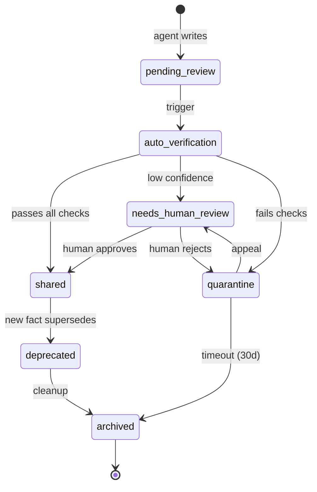
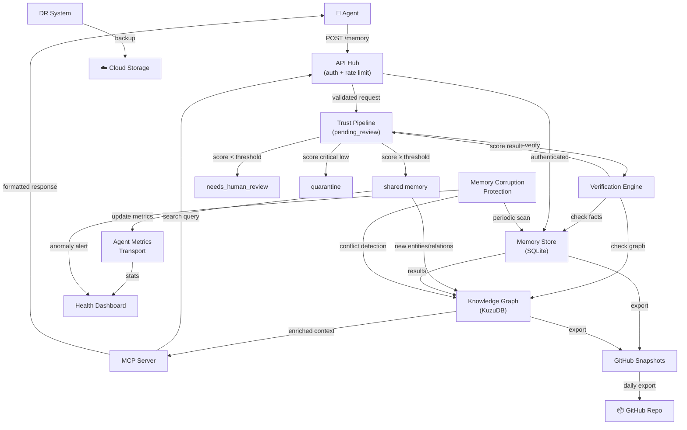

# memoryHub — Архитектурный документ

> **Версия:** 1.0.0  
> **Дата:** 2026-04-26  
> **Статус:** Living Document — главный источник правды о проекте  
> **Аудитория:** Разработчики, архитекторы, AI-агенты работающие с системой

---

## Содержание

1. [Обзор проекта](#1-обзор-проекта)
2. [Принципы проектирования](#2-принципы-проектирования)
3. [Архитектура системы (Component Diagram)](#3-архитектура-системы)
4. [Компоненты системы](#4-компоненты-системы)
   - 4.1 [API Hub](#41-api-hub)
   - 4.2 [Knowledge Graph](#42-knowledge-graph)
   - 4.3 [Trust Pipeline](#43-trust-pipeline)
   - 4.4 [Memory Corruption Protection](#44-memory-corruption-protection)
   - 4.5 [MCP Server](#45-mcp-server)
   - 4.6 [Skills System](#46-skills-system)
   - 4.7 [Agent Metrics Transport](#47-agent-metrics-transport)
   - 4.8 [Health Monitoring & Alerting](#48-health-monitoring--alerting)
   - 4.9 [Disaster Recovery](#49-disaster-recovery)
   - 4.10 [GitHub Snapshots](#410-github-snapshots)
5. [Взаимодействие компонентов](#5-взаимодействие-компонентов)
6. [Data Flow](#6-data-flow)
7. [Trust Pipeline Flow](#7-trust-pipeline-flow)
8. [Monitoring Architecture](#8-monitoring-architecture)
9. [Deployment Diagram](#9-deployment-diagram)
10. [Единый конфиг](#10-единый-конфиг)
11. [Дорожная карта (12 недель)](#11-дорожная-карта-12-недель)
12. [Обработка ошибок и Graceful Degradation](#12-обработка-ошибок-и-graceful-degradation)
13. [Интерфейсы между компонентами (API Reference)](#13-интерфейсы-между-компонентами)
14. [Безопасность](#14-безопасность)
15. [Глоссарий](#15-глоссарий)

---

## 1. Обзор проекта

### Что такое memoryHub?

**memoryHub** — это централизованная система долговременной памяти для экосистемы AI-агентов. Это не просто хранилище данных — это **мозг** агентной системы: место где знания не только хранятся, но и верифицируются, структурируются в граф взаимосвязей, защищаются от деградации и доступны через стандартизированный протокол.

Ключевая идея: **память — это не файл и не база данных. Память — это живая система с доверием, верификацией и защитой.**

### Зачем это нужно?

Современные AI-агенты страдают от фундаментальной проблемы: у них нет надёжной долгосрочной памяти. Каждая сессия начинается с нуля, знания изолированы между агентами, а «воспоминания» могут быть искажены или потеряны. Существующие решения (векторные базы данных, flat files, простые key-value хранилища) не решают проблему на системном уровне:

- **Изоляция:** каждый агент хранит своё, не делится
- **Нет верификации:** агент может записать что угодно, включая галлюцинации
- **Нет структуры:** связи между фактами теряются
- **Нет защиты:** "Memory Poisoning" — атака через ложные воспоминания
- **Нет observability:** невозможно понять что происходит в памяти

memoryHub решает все эти проблемы системно.

### Для кого?

| Аудитория | Как используют |
|-----------|----------------|
| **AI-агенты** | Читают и пишут память через MCP Server / REST API |
| **Разработчики агентов** | Подключают агентов через Skills System |
| **Системные администраторы** | Мониторинг через Health Dashboard, управление через API Hub |
| **Пользователи агентов** | Верифицируют спорные факты через Trust Pipeline |
| **Операционная команда** | Disaster Recovery, GitHub Snapshots |

### Ключевые возможности

```
✅ Единое хранилище памяти для всей экосистемы агентов
✅ Knowledge Graph — не просто факты, а их взаимосвязи
✅ Trust Pipeline — контролируемый путь от "чернового" к "доверенному"
✅ Memory Corruption Protection — защита от деградации и отравления
✅ MCP-совместимый сервер — стандартный протокол
✅ Agent Metrics Transport — агенты отчитываются о качестве работы
✅ Health Monitoring — ранние предупреждения о проблемах
✅ Disaster Recovery — восстановление из облака за минуты
✅ GitHub Snapshots — версионирование всей памяти
```

---

## 2. Принципы проектирования

### P1 — Система, не набор инструментов

Все компоненты memoryHub интегрированы и знают друг о друге. Нет "изолированных модулей" — есть единая система с чёткими интерфейсами. Компоненты деградируют gracefully — если один упал, остальные продолжают работать в ограниченном режиме.

### P2 — Trust by Default is False

Любые данные от агента считаются **непроверенными** до прохождения Trust Pipeline. Агент никогда не пишет напрямую в "достоверную" память — только через pipeline с верификацией.

### P3 — Единый конфиг

Вся конфигурация системы живёт в одном файле `memoryhub.config.yaml`. Нет разбросанных `.env` файлов, нет конфигурации внутри кода. Один файл — полное описание системы.

### P4 — Observability First

Каждый компонент эмитит метрики, логи и traces. Система самодиагностична — она знает когда ей плохо и умеет предупреждать заранее.

### P5 — Graceful Degradation

Каждый компонент определяет своё поведение при недоступности зависимостей. Система продолжает работать в degraded режиме, а не падает целиком.

### P6 — Immutability of History

Факты в памяти не удаляются — они помечаются как устаревшие или опровергнутые. История изменений сохраняется всегда. Это ключевое свойство для аудита и восстановления.

---

## 3. Архитектура системы

### Component Diagram

```
╔══════════════════════════════════════════════════════════════════════════╗
║                           memoryHub System                               ║
║                                                                          ║
║  ┌─────────────────────────────────────────────────────────────────┐    ║
║  │                        INGRESS LAYER                            │    ║
║  │                                                                 │    ║
║  │  ┌─────────────────┐    ┌──────────────────────────────────┐   │    ║
║  │  │   MCP Server    │    │           API Hub                │   │    ║
║  │  │  (port 3100)    │    │         (port 3000)              │   │    ║
║  │  │                 │    │  ┌──────────┐  ┌──────────────┐  │   │    ║
║  │  │ Model Context   │    │  │ API Keys │  │ Rate Limiter │  │   │    ║
║  │  │ Protocol impl   │    │  │  Vault   │  │  (per agent) │  │   │    ║
║  │  │                 │    │  └──────────┘  └──────────────┘  │   │    ║
║  │  └────────┬────────┘    │  ┌─────────────────────────────┐ │   │    ║
║  │           │             │  │  Auth & Permissions Matrix  │ │   │    ║
║  │           └─────────────┤  └─────────────────────────────┘ │   │    ║
║  │                         └──────────────┬───────────────────┘   │    ║
║  └──────────────────────────────────────  │ ─────────────────────┘    ║
║                                           │                             ║
║  ┌──────────────────────────────────────────────────────────────────┐  ║
║  │                      TRUST LAYER                                  │  ║
║  │                                                                   │  ║
║  │  ┌──────────────────────────────────────────────────────────┐   │  ║
║  │  │                    Trust Pipeline                         │   │  ║
║  │  │                                                           │   │  ║
║  │  │  [AGENT] → [pending_review] → [verification] → [shared]  │   │  ║
║  │  │                                     │                     │   │  ║
║  │  │                              ┌──────┴──────┐             │   │  ║
║  │  │                              │   Memory    │             │   │  ║
║  │  │                              │ Corruption  │             │   │  ║
║  │  │                              │ Protection  │             │   │  ║
║  │  │                              └─────────────┘             │   │  ║
║  │  └──────────────────────────────────────────────────────────┘   │  ║
║  └──────────────────────────────────────────────────────────────────┘  ║
║                                                                          ║
║  ┌──────────────────────────────────────────────────────────────────┐  ║
║  │                      STORAGE LAYER                                │  ║
║  │                                                                   │  ║
║  │  ┌─────────────────────┐   ┌──────────────────────────────────┐ │  ║
║  │  │   Knowledge Graph   │   │      Raw Memory Store            │ │  ║
║  │  │   (KuzuDB embed)    │   │   (SQLite / PostgreSQL)          │ │  ║
║  │  │                     │   │                                  │ │  ║
║  │  │  Entities           │   │  memories table                  │ │  ║
║  │  │  Relations          │   │  pending_review table            │ │  ║
║  │  │  Conflict detect    │   │  quarantine table                │ │  ║
║  │  │  Temporal graph     │   │  audit_log table                 │ │  ║
║  │  └─────────────────────┘   └──────────────────────────────────┘ │  ║
║  └──────────────────────────────────────────────────────────────────┘  ║
║                                                                          ║
║  ┌──────────────────────────────────────────────────────────────────┐  ║
║  │                   OBSERVABILITY LAYER                             │  ║
║  │                                                                   │  ║
║  │  ┌──────────────────┐  ┌────────────────┐  ┌────────────────┐  │  ║
║  │  │ Agent Metrics    │  │   Health Mon.  │  │  Skills System │  │  ║
║  │  │ Transport        │  │   & Alerting   │  │  (OpenClaw)    │  │  ║
║  │  │                  │  │                │  │                │  │  ║
║  │  │ metrics ingest   │  │ dashboard      │  │ memoryhub.md   │  │  ║
║  │  │ aggregation      │  │ early warning  │  │ search.md      │  │  ║
║  │  │ reporting        │  │ alert router   │  │ trust.md       │  │  ║
║  │  └──────────────────┘  └────────────────┘  └────────────────┘  │  ║
║  └──────────────────────────────────────────────────────────────────┘  ║
║                                                                          ║
║  ┌──────────────────────────────────────────────────────────────────┐  ║
║  │                    RESILIENCE LAYER                               │  ║
║  │                                                                   │  ║
║  │  ┌─────────────────────────────┐  ┌──────────────────────────┐  │  ║
║  │  │      Disaster Recovery      │  │    GitHub Snapshots       │  │  ║
║  │  │                             │  │                           │  │  ║
║  │  │  cloud backup (S3/B2)       │  │  versioned exports        │  │  ║
║  │  │  point-in-time recovery     │  │  automated commits        │  │  ║
║  │  │  restore verification       │  │  diff history             │  │  ║
║  │  └─────────────────────────────┘  └──────────────────────────┘  │  ║
║  └──────────────────────────────────────────────────────────────────┘  ║
╚══════════════════════════════════════════════════════════════════════════╝
```

---

## 4. Компоненты системы

### 4.1 API Hub

**Роль:** Единая точка входа для всех внешних запросов к memoryHub. Управляет аутентификацией, авторизацией и rate limiting.

**Порт:** `3000`  
**Протокол:** HTTP/REST + WebSocket для streaming

#### Подсистемы

**API Key Vault**  
Хранит и управляет API ключами агентов. Каждый ключ привязан к:
- `agent_id` — уникальный идентификатор агента
- `permissions` — список разрешённых операций (read, write, admin)
- `rate_limit` — персональный лимит запросов
- `trust_level` — уровень доверия (anonymous, registered, verified, trusted)
- `expires_at` — время истечения ключа

```
Key format: mhub_<env>_<agent_id_prefix>_<random_32bytes_base58>
Example:    mhub_prod_alfred_4xKj9mN2pQr7sT8vWx3yZ6aB
```

**Rate Limiter**  
Реализован через sliding window algorithm. Три уровня лимитов:

| Уровень | Write RPM | Read RPM | Bulk ops/hour |
|---------|-----------|----------|---------------|
| anonymous | 5 | 20 | 0 |
| registered | 30 | 120 | 10 |
| verified | 100 | 500 | 50 |
| trusted | 500 | 2000 | unlimited |

При превышении лимита → `429 Too Many Requests` с заголовком `Retry-After`.

**Auth & Permissions Matrix**  
Матрица разрешений определяет что может делать каждый агент:

```yaml
permissions:
  read:          # Читать память
  write:         # Писать в pending_review
  verify:        # Верифицировать чужие записи
  admin_read:    # Читать метаданные системы
  admin_write:   # Управлять агентами и ключами
  quarantine:    # Помещать в карантин
  restore:       # Восстанавливать из DR
```

**Эндпоинты API Hub**

```
POST /v1/keys                  # Создать API key (admin only)
GET  /v1/keys/:id              # Информация о ключе
DELETE /v1/keys/:id            # Отозвать ключ
GET  /v1/agents                # Список агентов
GET  /v1/agents/:id/metrics    # Метрики агента
GET  /v1/health                # Health check
GET  /v1/status                # Полный статус системы
```

**Graceful Degradation:**  
Если Key Vault недоступен → API Hub переходит в read-only режим с кешированными ключами. Если Rate Limiter недоступен → применяются консервативные лимиты hardcoded в конфиге.

---

### 4.2 Knowledge Graph

**Роль:** Структурированное хранилище знаний в виде графа сущностей и отношений. Позволяет понимать не только отдельные факты, но и связи между ними.

**Движок:** KuzuDB (embedded) — встроенная OLAP graph database, не требует отдельного процесса.

#### Модель данных

**Сущности (Nodes)**

```
Entity {
  id:           UUID
  name:         String
  type:         EntityType  # person, place, concept, event, thing, agent
  aliases:      String[]
  description:  String
  created_at:   Timestamp
  updated_at:   Timestamp
  confidence:   Float (0.0-1.0)
  source:       String      # какой агент создал
  tags:         String[]
}
```

**Отношения (Edges)**

```
Relation {
  id:           UUID
  from_entity:  Entity.id
  to_entity:    Entity.id
  type:         RelationType
  strength:     Float (0.0-1.0)
  valid_from:   Timestamp
  valid_until:  Timestamp | null  # null = актуально сейчас
  confidence:   Float
  source:       String
  evidence:     String[]   # ссылки на memory records
}
```

**Типы отношений (RelationType)**

```
IS_A           # is a kind of
HAS_PROPERTY   # has attribute
RELATED_TO     # general relation
LOCATED_IN     # spatial
HAPPENED_AT    # temporal
CAUSED_BY      # causal
PRECEDED_BY    # temporal sequence
CONTRADICTS    # conflict marker
SUPPORTS       # evidence relation
PART_OF        # compositional
KNOWS          # social graph
WORKS_ON       # agent-task relation
```

#### Conflict Detection

Система автоматически обнаруживает конфликты в графе:

```
ConflictType:
  DIRECT_CONTRADICTION    # A says X, B says NOT X
  TEMPORAL_CONFLICT       # fact valid at same time with opposite claim
  PROPERTY_CONFLICT       # same entity, same property, different values
  LOGICAL_INCONSISTENCY   # derived from graph traversal rules
```

При обнаружении конфликта:
1. Создаётся `ConflictRecord` с обоими утверждениями
2. Оба утверждения помечаются флагом `has_conflict: true`
3. Более новое утверждение получает `status: pending_conflict_resolution`
4. Событие отправляется в Trust Pipeline для ручной или автоматической верификации
5. Health Monitoring получает сигнал о конфликте

#### Temporal Graph

Knowledge Graph поддерживает временные срезы — можно запросить состояние графа на любой момент в прошлом:

```
GET /v1/graph/snapshot?at=2026-01-15T10:00:00Z
```

**KuzuDB Cypher Queries (примеры)**

```cypher
-- Найти все сущности связанные с агентом
MATCH (a:Entity {name: 'alfred'})-[r]-(e:Entity)
RETURN a, r, e LIMIT 50;

-- Найти конфликты
MATCH (e1:Entity)-[r:CONTRADICTS]-(e2:Entity)
WHERE r.resolved = false
RETURN e1, r, e2;

-- Путь между двумя сущностями
MATCH path = shortestPath((a:Entity {name: 'Sergey'})-[*]-(b:Entity {name: 'memoryHub'}))
RETURN path;
```

---

### 4.3 Trust Pipeline

**Роль:** Контролируемый процесс верификации данных от агентов. Обеспечивает что в "достоверную" память попадает только проверенная информация.

#### Статусная машина



#### ASCII Flow Diagram

```
Agent
  │
  │ POST /v1/memory  {content, tags, source, confidence}
  ▼
┌─────────────────────┐
│   pending_review    │  ← Все входящие данные
│   (staging area)    │
└─────────┬───────────┘
          │
          │  Auto-Verification (async, ~30sec)
          ▼
┌─────────────────────────────────────────────────────┐
│              Verification Engine                     │
│                                                      │
│  ① Fact Checker        — проверка против known facts│
│  ② Anomaly Detector    — статистический анализ      │
│  ③ Source Credibility  — рейтинг агента-источника   │
│  ④ Conflict Scanner    — проверка в KnowledgeGraph  │
│  ⑤ Confidence Scorer   — итоговый скор              │
└──────────┬──────────────────────┬────────────────────┘
           │                      │
     score ≥ threshold      score < threshold
     + no conflicts         или есть конфликты
           │                      │
           ▼                      ▼
    ┌──────────┐         ┌──────────────────┐
    │  shared  │         │ needs_human_rev  │
    │ (доверен)│         │  или quarantine  │
    └──────────┘         └──────────────────┘
```

#### Verification Engine — детали

**① Fact Checker**  
Сравнивает новый факт с существующими в памяти. Использует семантическое сходство (embedding comparison) + точное совпадение ключевых сущностей.

**② Anomaly Detector**  
Статистический анализ:
- Слишком высокая частота записей от одного агента
- Необычно высокая confidence заявлена агентом
- Резкое изменение паттерна записей
- Запись в нерабочее время агента

**③ Source Credibility**  
Каждый агент имеет `credibility_score` (0.0-1.0), вычисленный из:
- Историческая точность его записей
- Количество опровергнутых фактов
- Время в системе
- Верификация агента администратором

**④ Conflict Scanner**  
Запрос к Knowledge Graph: есть ли существующие факты которые противоречат новому?

**⑤ Confidence Scorer**  
```
final_score = (
  fact_check_score * 0.30 +
  anomaly_score   * 0.20 +
  credibility     * 0.30 +
  conflict_score  * 0.20
)

if final_score >= config.trust.auto_approve_threshold:
    status = "shared"
elif final_score >= config.trust.human_review_threshold:
    status = "needs_human_review"
else:
    status = "quarantine"
```

#### Human Review Interface

Когда запись попадает в `needs_human_review`:
1. Создаётся задача в очереди ревью
2. Уведомление через Health Dashboard
3. Опционально — уведомление в Telegram (если настроен alert channel)
4. Ревьюер видит: сам факт, источник, скор каждого чекера, похожие факты

```
POST /v1/review/:id/approve   {"reviewer_id": "...", "comment": "..."}
POST /v1/review/:id/reject    {"reviewer_id": "...", "reason": "..."}
```

---

### 4.4 Memory Corruption Protection

**Роль:** Защита памяти от деградации, отравления (poisoning) и случайных ошибок. Работает как непрерывный фоновый процесс.

#### Подсистемы

**Fact Checker (Continuous)**  
Периодически проверяет все записи в `shared` памяти на внутреннюю согласованность:
- Кросс-валидация между записями (нет ли противоречий)
- Проверка ссылочной целостности в Knowledge Graph
- Обнаружение "дрейфа" — постепенного изменения фактов через серию мелких правок

Расписание: каждые 6 часов полный scan, каждые 15 минут — scan новых записей.

**Anomaly Detector**  
Мониторит паттерны записи в реальном времени:

```python
# Примеры аномалий которые детектируются:
- Burst write: >50 записей от одного агента за 5 минут
- Contradicting flood: серия записей опровергающих существующие факты
- Identity confusion: агент пишет факты о сущностях вне своей области
- Confidence inflation: агент систематически завышает confidence
- Pattern mimicry: новый агент пишет идентично доверенному
```

**Quarantine System**  
Изолированное хранилище для подозрительных записей:

```
quarantine {
  record_id:     UUID
  original_data: JSON
  reason:        String
  severity:      low | medium | high | critical
  quarantined_at: Timestamp
  quarantined_by: String  # агент или система
  expires_at:    Timestamp  # auto-archive after 30d
  review_count:  Int
  last_reviewed: Timestamp
}
```

Quarantine не блокирует систему — записи в карантине просто недоступны агентам через обычный API. Они доступны только через admin API с явным флагом `include_quarantine=true`.

**Integrity Checksums**  
Каждая запись в `shared` памяти имеет криптографическую подпись:
```
signature = HMAC-SHA256(content + created_at + source_agent, system_key)
```
При чтении подпись верифицируется. Несоответствие → запись помечается `integrity_violation` и уходит в карантин.

**Temporal Consistency Check**  
Проверяет что временная последовательность фактов логична:
- Факт не может ссылаться на событие которое "ещё не произошло" на момент его записи
- Отношения в Knowledge Graph временно согласованы

---

### 4.5 MCP Server

**Роль:** Реализация Model Context Protocol — стандартного протокола взаимодействия AI-агентов с внешними системами. Позволяет любому MCP-совместимому агенту (Claude, OpenAI, Gemini и др.) использовать memoryHub без кастомной интеграции.

**Порт:** `3100`  
**Протокол:** JSON-RPC 2.0 over HTTP + Server-Sent Events

#### MCP Tools (доступные агентам)

```
memory_search {
  description: "Search memories by semantic query"
  params:
    q:        String   # поисковый запрос
    limit:    Int      # max 50, default 10
    tags:     String[] # фильтр по тегам
    min_confidence: Float # минимальный порог
}

memory_write {
  description: "Write a new memory (goes through Trust Pipeline)"
  params:
    content:    String
    tags:       String[]
    source:     String  # agent identifier
    confidence: Float   # 0.0-1.0
}

memory_recall {
  description: "Get recent memories"
  params:
    limit: Int  # max 100, default 20
    since: ISO8601 timestamp
}

graph_query {
  description: "Query the Knowledge Graph"
  params:
    cypher: String  # Cypher query (read-only)
    limit:  Int
}

graph_relate {
  description: "Create a relation between entities"
  params:
    from_entity: String  # entity name or id
    to_entity:   String
    relation:    RelationType
    confidence:  Float
    evidence:    String[]
}

memory_status {
  description: "Get system health and stats"
  params: {}
}
```

#### MCP Resources

```
memoryhub://memories/{id}         # конкретная запись
memoryhub://graph/entity/{name}   # сущность в графе
memoryhub://graph/path/{a}/{b}    # путь между сущностями
memoryhub://stats/agent/{id}      # статистика агента
```

#### MCP Prompts

```
memoryhub_search_context  # Найти релевантный контекст для задачи
memoryhub_fact_check      # Проверить факт против памяти
memoryhub_relate          # Найти связанные концепции
```

#### Пример взаимодействия (JSON-RPC)

```json
// Запрос агента
{
  "jsonrpc": "2.0",
  "id": 1,
  "method": "tools/call",
  "params": {
    "name": "memory_search",
    "arguments": {
      "q": "Sergey preferences coffee morning",
      "limit": 5,
      "min_confidence": 0.7
    }
  }
}

// Ответ сервера
{
  "jsonrpc": "2.0",
  "id": 1,
  "result": {
    "content": [{
      "type": "text",
      "text": "[{\"id\": \"...\", \"content\": \"Sergey drinks black coffee every morning\", \"confidence\": 0.92, \"tags\": [\"preference\", \"morning\"], \"created_at\": \"2026-03-15T09:00:00Z\"}]"
    }]
  }
}
```

---

### 4.6 Skills System

**Роль:** Набор OpenClaw skills которые предоставляют агентам удобный интерфейс для работы с memoryHub. Абстрагируют детали протокола за понятными командами.

**Расположение:** `skills/memoryhub/`

#### Структура Skills

```
skills/memoryhub/
├── SKILL.md              # Основной skill (search, write, recall)
├── skills/
│   ├── search/SKILL.md   # Семантический поиск
│   ├── trust/SKILL.md    # Управление Trust Pipeline
│   ├── graph/SKILL.md    # Работа с Knowledge Graph
│   ├── admin/SKILL.md    # Административные операции
│   └── metrics/SKILL.md  # Отправка и чтение метрик
```

#### Основной SKILL.md — интерфейс

```markdown
## memoryHub Skill

### Поиск памяти
curl "http://localhost:3000/v1/memory/search?q={query}&limit={n}"
Headers: Authorization: Bearer {API_KEY}

### Запись памяти
curl -X POST "http://localhost:3000/v1/memory" \
  -H "Authorization: Bearer {API_KEY}" \
  -d '{"content": "...", "tags": [...], "confidence": 0.8}'

### Последние воспоминания
curl "http://localhost:3000/v1/memory/recent?limit=20"
  -H "Authorization: Bearer {API_KEY}"

### Граф — найти сущность
curl "http://localhost:3000/v1/graph/entity/{name}"

### Граф — создать связь
curl -X POST "http://localhost:3000/v1/graph/relations" \
  -d '{"from": "...", "to": "...", "type": "RELATED_TO", "confidence": 0.8}'
```

#### Trust Skill — специальные операции

```markdown
## Trust Management Skill

### Посмотреть очередь на ревью
curl "http://localhost:3000/v1/review/queue"

### Одобрить запись
curl -X POST "http://localhost:3000/v1/review/{id}/approve" \
  -d '{"reviewer_id": "alfred", "comment": "Verified against source"}'

### Отклонить запись
curl -X POST "http://localhost:3000/v1/review/{id}/reject" \
  -d '{"reason": "Contradicts established fact #xyz"}'

### Посмотреть карантин (admin)
curl "http://localhost:3000/v1/quarantine" \
  -H "Authorization: Bearer {ADMIN_KEY}"
```

---

### 4.7 Agent Metrics Transport

**Роль:** Инфраструктура для того чтобы агенты отчитывались о качестве своей работы. Это bidirectional — memoryHub знает о здоровье агентов, агенты получают feedback о качестве своих записей.

#### Что агенты репортируют

```
AgentMetricsReport {
  agent_id:         String
  timestamp:        ISO8601
  session_id:       String  # опционально

  # Качество памяти
  memories_written:          Int
  memories_rejected:         Int
  memories_auto_approved:    Int
  memories_human_reviewed:   Int
  avg_confidence_claimed:    Float
  avg_confidence_actual:     Float  # после верификации

  # Качество работы агента
  task_success_rate:    Float (0-1)
  hallucination_count:  Int   # самодиагностика
  correction_count:     Int   # сколько раз исправлял себя
  user_satisfaction:    Float # если агент получает feedback

  # Операционное
  latency_p50_ms:  Int
  latency_p95_ms:  Int
  error_count:     Int
  context_size_tokens: Int  # расход токенов
}
```

#### Эндпоинты

```
POST /v1/metrics/report         # Отправить отчёт
GET  /v1/metrics/agent/:id      # Метрики конкретного агента
GET  /v1/metrics/summary        # Сводка по всем агентам
GET  /v1/metrics/leaderboard    # Рейтинг агентов по качеству
```

#### Agent Feedback Loop

memoryHub не просто принимает метрики — он возвращает агентам feedback:

```json
// GET /v1/metrics/agent/alfred/feedback
{
  "agent_id": "alfred",
  "period": "7d",
  "feedback": {
    "accuracy_trend": "+0.05",
    "most_rejected_topics": ["stock prices", "exact dates"],
    "credibility_score": 0.87,
    "recommendations": [
      "Reduce confidence claims on time-sensitive data",
      "Add source citations for factual claims"
    ]
  }
}
```

Это позволяет агентам адаптироваться — калибровать уверенность, избегать тем где они систематически ошибаются.

#### Aggregation & Storage

Метрики хранятся в time-series формате:
- Hot storage: последние 7 дней (in-memory + SQLite)
- Warm storage: 7-90 дней (SQLite)
- Cold storage: >90 дней (GitHub Snapshots / cloud archive)

---

### 4.8 Health Monitoring & Alerting

**Роль:** Непрерывный мониторинг состояния всей системы с ранним предупреждением о проблемах. Dashboard для операционной команды.

#### Health Checks (per component)

```
Component Health Status:
  ✅ healthy     — работает нормально
  ⚠️ degraded    — работает с ограничениями
  🔴 unhealthy   — не работает, degradation активна
  ❓ unknown     — нет данных (сам по себе проблема)
```

| Компонент | Метрики мониторинга | Порог предупреждения |
|-----------|---------------------|---------------------|
| API Hub | req/sec, error rate, p95 latency | error_rate > 1%, latency > 500ms |
| Knowledge Graph | query latency, graph size, conflict rate | latency > 2s, conflicts > 10/hour |
| Trust Pipeline | queue depth, auto-approve rate, review backlog | queue > 100, backlog > 48h |
| MCP Server | connected agents, active sessions | session errors > 5% |
| Memory Store | disk usage, write rate, read latency | disk > 80%, latency > 200ms |
| DR System | last backup age, backup size | last_backup > 24h ago |

#### Early Warning System

Многоуровневая система предупреждений:

```
Level 1 — INFO:     Аномалия обнаружена, мониторим
Level 2 — WARNING:  Тренд нехороший, нужно внимание
Level 3 — ALERT:    Активная проблема, нужно действие
Level 4 — CRITICAL: Система в опасности, немедленное действие
```

**Predictive Alerts** — система смотрит на тренды, а не только на пороговые значения:
```
"Disk usage trending: +2.3 GB/day. At current rate, 80% threshold 
 reached in 6 days. Recommend: run cleanup or expand storage."
```

#### Dashboard

```
memoryHub Health Dashboard
━━━━━━━━━━━━━━━━━━━━━━━━━━━━━━━━━━━━━━━━━━━━━━━━━━
 System Status: ✅ HEALTHY        Last update: 13:42:07

 ┌─────────────────────────────────────────────────┐
 │ COMPONENTS                                       │
 │  API Hub          ✅  p95: 84ms   req/s: 12.3   │
 │  Knowledge Graph  ✅  queries/s: 8.1  size: 45k │
 │  Trust Pipeline   ✅  queue: 3    backlog: 0     │
 │  MCP Server       ✅  agents: 4   sessions: 7    │
 │  Memory Store     ✅  disk: 2.1GB  writes/m: 18  │
 │  DR System        ✅  last: 2h ago  size: 1.8GB  │
 └─────────────────────────────────────────────────┘

 ┌─────────────────────────────────────────────────┐
 │ AGENT ACTIVITY (last 1h)                         │
 │  alfred      wrote: 23  approved: 21  rejected: 2│
 │  subagent-1  wrote: 8   approved: 8   rejected: 0│
 │  subagent-2  wrote: 0   (offline)                │
 └─────────────────────────────────────────────────┘

 ┌─────────────────────────────────────────────────┐
 │ ALERTS (last 24h)                                │
 │  ⚠️  13:12  Trust Pipeline: 5 items in review   │
 │  ℹ️  09:30  Backup completed: 1.8 GB             │
 └─────────────────────────────────────────────────┘
```

#### Alert Router

Куда отправляются алерты:

```yaml
alert_routes:
  - level: [WARNING, ALERT, CRITICAL]
    channels: [telegram]
    telegram:
      chat_id: "${ALERT_TELEGRAM_CHAT_ID}"
      
  - level: [CRITICAL]
    channels: [telegram, log]
    message_prefix: "🚨 CRITICAL:"
    
  - level: [INFO]
    channels: [log]  # только в лог, не беспокоить
```

---

### 4.9 Disaster Recovery

**Роль:** Полное восстановление системы из облачного бэкапа при катастрофическом сбое. Point-in-time recovery — восстановление на любой момент в прошлом.

#### Backup Strategy

**3-2-1 правило:**
- **3** копии данных
- **2** разных носителя (локальный диск + облако)
- **1** копия offsite (cloud: S3 или Backblaze B2)

**Расписание бэкапов:**

| Тип | Частота | Хранение | Размер (est) |
|-----|---------|----------|--------------|
| Incremental | Каждые 6 часов | 7 дней | ~100MB |
| Daily Full | Ежедневно 03:00 | 30 дней | ~2GB |
| Weekly Archive | Каждое воскресенье | 1 год | ~5GB |
| Monthly Snapshot | 1-е числа месяца | Forever | ~10GB |

#### Что бэкапится

```
Backup содержит:
  /db/memoryhub.sqlite          # Основная база данных
  /db/kuzu/                     # Knowledge Graph данных
  /config/memoryhub.config.yaml # Конфигурация
  /keys/                        # API ключи (зашифровано)
  /metrics/                     # Метрики агентов
  metadata.json                 # Версия, timestamp, checksum
```

#### Процедура восстановления

```bash
# 1. Список доступных точек восстановления
memoryhub dr list-snapshots

# 2. Восстановить на конкретный момент
memoryhub dr restore --snapshot 2026-04-25T03:00:00Z

# 3. Восстановить в изолированную среду (для проверки)
memoryhub dr restore --snapshot 2026-04-25T03:00:00Z --dry-run --target /tmp/restore-test

# 4. Верификация восстановленных данных
memoryhub dr verify --path /tmp/restore-test
```

#### Recovery Time Objectives

```
RTO (Recovery Time Objective): < 15 минут
RPO (Recovery Point Objective): < 6 часов
MTTR (Mean Time To Recovery):   < 10 минут (при наличии snapshot)
```

#### Restore Verification

После каждого восстановления автоматически запускается:
1. Integrity check всех записей (checksum verification)
2. Knowledge Graph consistency check
3. Контрольная выборка — 100 случайных записей, проверка читаемости
4. Trust Pipeline состояние — статусы корректны?
5. API Hub — ключи валидны?

Результат верификации → в Health Dashboard и в Alert Router.

---

### 4.10 GitHub Snapshots

**Роль:** Версионирование памяти через Git. Каждый снапшот — это commit в репозитории. Позволяет видеть историю изменений, делать diff между состояниями, экспортировать память для review.

#### Как это работает

```
Daily (03:15 UTC):
  1. Export всей shared памяти в JSON
  2. Export Knowledge Graph в Cypher format
  3. Export метрик за день
  4. git add, git commit, git push

Weekly (Sunday 04:00 UTC):
  1. Полный export включая metadata
  2. Тэгируем commit: v{year}.{week}
  3. Создаём Release с changelog (что изменилось за неделю)
```

#### Структура репозитория

```
memoryhub-snapshots/
├── README.md                    # Описание репозитория
├── latest/
│   ├── memories.json            # Все shared записи
│   ├── knowledge-graph.cypher   # Граф в Cypher
│   ├── agents.json              # Агенты и их статусы
│   └── stats.json               # Статистика системы
├── archive/
│   ├── 2026-04/                 # По месяцам
│   │   ├── 2026-04-25.json
│   │   └── ...
│   └── ...
├── schemas/
│   ├── memory.schema.json       # JSON Schema для записей
│   └── graph.schema.json        # Схема графа
└── CHANGELOG.md                 # Автогенерируемый лог изменений
```

#### Git Diff как аудит

```bash
# Что изменилось в памяти за последнюю неделю?
git diff v2026.16 v2026.17 -- latest/memories.json

# Когда был добавлен конкретный факт?
git log -S "Sergey drinks coffee" -- latest/memories.json

# Какой агент добавил больше всего фактов на прошлой неделе?
git show v2026.17:latest/stats.json | jq '.agent_activity'
```

---

## 5. Взаимодействие компонентов

### Матрица взаимодействий

```
              │ API  │ KGraph│ Trust │ MemProt│ MCP  │ Skills│ AMT  │ Health│ DR   │ GH   │
──────────────┼──────┼───────┼───────┼────────┼──────┼───────┼──────┼───────┼──────┼──────┤
API Hub       │  —   │  R    │  RW   │  R     │  RW  │  —    │  R   │  W    │  R   │  —   │
KGraph        │  —   │  —    │  R    │  RW    │  —   │  —    │  —   │  W    │  RW  │  W   │
Trust Pipeline│  R   │  RW   │  —    │  RW    │  —   │  —    │  R   │  W    │  —   │  —   │
MemProtection │  —   │  RW   │  W    │  —     │  —   │  —    │  —   │  W    │  —   │  —   │
MCP Server    │  RW  │  R    │  —    │  —     │  —   │  R    │  W   │  R    │  —   │  —   │
Skills        │  R   │  —    │  R    │  —     │  RW  │  —    │  —   │  —    │  —   │  —   │
AgentMetrics  │  R   │  —    │  R    │  —     │  —   │  —    │  —   │  W    │  W   │  W   │
Health Mon.   │  R   │  R    │  R    │  R     │  R   │  —    │  R   │  —    │  R   │  —   │
DR System     │  R   │  R    │  —    │  —     │  —   │  —    │  R   │  W    │  —   │  RW  │
GH Snapshots  │  —   │  R    │  —    │  —     │  —   │  —    │  R   │  —    │  —   │  —   │

R = читает, W = пишет, RW = читает и пишет
```

### Критические пути (Critical Paths)

**Путь 1: Агент записывает факт**
```
Agent → MCP Server → API Hub (auth) → Trust Pipeline (pending_review)
  → Memory Corruption Protection (scan) → Trust Pipeline (verification)
  → Knowledge Graph (добавить сущности/связи) → Memory Store (shared)
  → Agent Metrics Transport (обновить статистику агента)
  → Health Monitoring (обновить dashboard)
```

**Путь 2: Агент ищет информацию**
```
Agent → MCP Server → API Hub (auth + rate limit) → Memory Store (search)
  → Knowledge Graph (контекст связей) → Memory Store (enriched results)
  → MCP Server (format response) → Agent
```

**Путь 3: Обнаружен конфликт**
```
Memory Corruption Protection (scan) → Knowledge Graph (ConflictRecord)
  → Trust Pipeline (needs_human_review) → Health Monitoring (alert)
  → Alert Router (Telegram notification) → Human reviews
  → Trust Pipeline (approve/reject) → Knowledge Graph (update)
  → Memory Corruption Protection (re-scan affected area)
```

**Путь 4: Disaster Recovery**
```
Trigger (human или auto) → DR System (select snapshot)
  → Cloud Storage (download) → Local restore
  → Memory Store (restore DB) → Knowledge Graph (restore)
  → API Hub (reload keys) → DR System (run verify)
  → Health Monitoring (full health check)
  → Alert Router (success/failure notification)
```

---

## 6. Data Flow



---

## 7. Trust Pipeline Flow

```
╔══════════════════════════════════════════════════════════════════════╗
║                      TRUST PIPELINE FLOW                             ║
╠══════════════════════════════════════════════════════════════════════╣
║                                                                      ║
║  ┌──────────┐                                                        ║
║  │  AGENT   │  "Sergey prefers dark roast coffee"                   ║
║  │          │  confidence: 0.85, source: alfred                      ║
║  └────┬─────┘                                                        ║
║       │                                                              ║
║       ▼ POST /v1/memory                                              ║
║  ┌────────────────┐                                                  ║
║  │   API Hub      │  ✓ Auth OK (alfred, trusted)                    ║
║  │                │  ✓ Rate limit OK (87/500 rpm)                   ║
║  └────┬───────────┘                                                  ║
║       │                                                              ║
║       ▼                                                              ║
║  ┌────────────────────────────┐                                      ║
║  │  pending_review            │  id: mem_abc123                      ║
║  │  status: awaiting_verify   │  queued_at: 13:42:07                 ║
║  └────┬───────────────────────┘                                      ║
║       │                                                              ║
║       ▼  (async, ~30 seconds)                                        ║
║  ╔════════════════════════════════════════════════════════╗          ║
║  ║  VERIFICATION ENGINE                                    ║          ║
║  ║                                                         ║          ║
║  ║  ① Fact Checker      "dark roast" ↔ no contradiction  ║          ║
║  ║                       score: 0.90                       ║          ║
║  ║                                                         ║          ║
║  ║  ② Anomaly Detector  normal write rate, normal pattern ║          ║
║  ║                       score: 0.95                       ║          ║
║  ║                                                         ║          ║
║  ║  ③ Source Credibility alfred credibility: 0.87         ║          ║
║  ║                       score: 0.87                       ║          ║
║  ║                                                         ║          ║
║  ║  ④ Conflict Scanner  no contradicting facts in KGraph  ║          ║
║  ║                       score: 1.00                       ║          ║
║  ║                                                         ║          ║
║  ║  ⑤ Final Score       0.90×0.30 + 0.95×0.20 +          ║          ║
║  ║                        0.87×0.30 + 1.00×0.20 = 0.928  ║          ║
║  ╚════════════════════════════════════════════════════════╝          ║
║       │                                                              ║
║       │  0.928 ≥ 0.80 (auto_approve_threshold)                      ║
║       ▼                                                              ║
║  ┌────────────────────────────┐                                      ║
║  │  SHARED                    │  ✅ Доступна всем агентам            ║
║  │  status: shared            │  Knowledge Graph обновлён            ║
║  │  confidence: 0.928         │  Метрики alfred обновлены            ║
║  └────────────────────────────┘                                      ║
║                                                                      ║
║  ──────────────────────────────── АЛЬТЕРНАТИВНЫЙ ПУТЬ ────────────  ║
║                                                                      ║
║  Если score < 0.60 (quarantine_threshold):                           ║
║       ▼                                                              ║
║  ┌────────────────────────────┐                                      ║
║  │  QUARANTINE                │  🔴 Изолирована                      ║
║  │  severity: medium          │  Alert → Health Dashboard            ║
║  │  expires: +30 days         │  Уведомление в Telegram              ║
║  └────────────────────────────┘                                      ║
║                                                                      ║
║  Если 0.60 ≤ score < 0.80 (needs_human_review):                     ║
║       ▼                                                              ║
║  ┌────────────────────────────┐                                      ║
║  │  NEEDS_HUMAN_REVIEW        │  ⚠️ В очереди ревью                 ║
║  │  assigned_to: admin        │  Уведомление администратору          ║
║  └────────────────────────────┘                                      ║
║                                                                      ║
╚══════════════════════════════════════════════════════════════════════╝
```

---

## 8. Monitoring Architecture

```
╔═══════════════════════════════════════════════════════════════════╗
║                   MONITORING ARCHITECTURE                          ║
╠═══════════════════════════════════════════════════════════════════╣
║                                                                   ║
║  DATA SOURCES (each component emits):                            ║
║  ┌──────┐ ┌──────┐ ┌──────┐ ┌──────┐ ┌──────┐ ┌──────┐        ║
║  │ API  │ │KGrap │ │Trust │ │MemPr │ │ MCP  │ │  DR  │        ║
║  │ Hub  │ │ ph   │ │ Pipe │ │ otec │ │Serve │ │System│        ║
║  └──┬───┘ └──┬───┘ └──┬───┘ └──┬───┘ └──┬───┘ └──┬───┘        ║
║     │        │        │        │        │        │             ║
║     └────────┴────────┴────────┴────────┴────────┘             ║
║                              │                                   ║
║                              ▼                                   ║
║  ┌────────────────────────────────────────────────────────────┐ ║
║  │                  METRICS COLLECTOR                          │ ║
║  │                                                             │ ║
║  │  Collects every 15s:                                        │ ║
║  │  - Component health status                                  │ ║
║  │  - Performance metrics (latency, throughput)                │ ║
║  │  - Business metrics (records/hour, conflicts/day)           │ ║
║  │  - Resource metrics (disk, memory, CPU)                     │ ║
║  └────────────────────────┬───────────────────────────────────┘ ║
║                           │                                      ║
║           ┌───────────────┼────────────────┐                    ║
║           ▼               ▼                ▼                    ║
║  ┌──────────────┐  ┌────────────┐  ┌─────────────────┐        ║
║  │   Dashboard  │  │ Time Series│  │  Alert Engine   │        ║
║  │   (web UI)   │  │   Store    │  │                 │        ║
║  │              │  │  (SQLite   │  │  Threshold      │        ║
║  │  Real-time   │  │  + memory) │  │  Trend analysis │        ║
║  │  visualiz.   │  │            │  │  Predictive     │        ║
║  └──────────────┘  └────────────┘  └────────┬────────┘        ║
║                                              │                  ║
║                              ┌───────────────┴──────────┐      ║
║                              ▼                           ▼      ║
║                    ┌──────────────────┐       ┌──────────────┐ ║
║                    │  Telegram Alert  │       │  Log File    │ ║
║                    │  (critical/warn) │       │  (all levels)│ ║
║                    └──────────────────┘       └──────────────┘ ║
║                                                                  ║
╚═══════════════════════════════════════════════════════════════════╝
```

---

## 9. Deployment Diagram

```
╔════════════════════════════════════════════════════════════════════╗
║                     DEPLOYMENT DIAGRAM                             ║
╠════════════════════════════════════════════════════════════════════╣
║                                                                    ║
║  HOST: mac-mini (192.168.1.51)                                     ║
║  ┌─────────────────────────────────────────────────────────────┐  ║
║  │                    memoryhub process                         │  ║
║  │                    (Node.js / Python)                        │  ║
║  │                                                              │  ║
║  │  Port 3000 ───► API Hub                                      │  ║
║  │  Port 3100 ───► MCP Server                                   │  ║
║  │  Port 3200 ───► Health Dashboard (HTTP UI)                   │  ║
║  │                                                              │  ║
║  │  /data/memoryhub/                                            │  ║
║  │  ├── memoryhub.sqlite     (Memory Store)                     │  ║
║  │  ├── kuzu/                (Knowledge Graph)                  │  ║
║  │  ├── backups/             (Local backup copies)              │  ║
║  │  └── logs/                (Application logs)                 │  ║
║  │                                                              │  ║
║  │  Config: /etc/memoryhub/memoryhub.config.yaml               │  ║
║  └─────────────────────────────────────────────────────────────┘  ║
║                            │                                       ║
║       ┌────────────────────┼──────────────────┐                   ║
║       │                    │                  │                   ║
║       ▼                    ▼                  ▼                   ║
║  ┌──────────┐       ┌──────────┐       ┌──────────────┐          ║
║  │  Agents  │       │ OpenClaw │       │   Clients    │          ║
║  │  (MCP)   │       │ (Skills) │       │  (REST API)  │          ║
║  │          │       │          │       │              │          ║
║  │ alfred   │       │ skill    │       │ health dash  │          ║
║  │ subagent │       │ commands │       │ admin UI     │          ║
║  └──────────┘       └──────────┘       └──────────────┘          ║
║                                                                    ║
║  EXTERNAL DEPENDENCIES:                                            ║
║  ┌──────────────────────────────────────────────────────────────┐ ║
║  │  ☁️  Backblaze B2 / AWS S3                                    │ ║
║  │      └── /memoryhub-backups/                                  │ ║
║  │                                                               │ ║
║  │  📦  GitHub                                                   │ ║
║  │      └── memoryhub-snapshots (private repo)                   │ ║
║  │                                                               │ ║
║  │  📱  Telegram Bot API                                         │ ║
║  │      └── Alert notifications                                   │ ║
║  └──────────────────────────────────────────────────────────────┘ ║
║                                                                    ║
║  SYSTEMD SERVICE:                                                  ║
║  memoryhub.service  ── autostart, restart on failure              ║
║  memoryhub-dr.timer ── cron: backup every 6h                      ║
║  memoryhub-gh.timer ── cron: snapshot daily 03:15                 ║
╚════════════════════════════════════════════════════════════════════╝
```

---

## 10. Единый конфиг

Полное описание всех параметров системы в одном файле. Нет скрытой конфигурации — всё здесь.

```yaml
# /etc/memoryhub/memoryhub.config.yaml
# memoryHub — единый конфиг системы
# Версия: 1.0.0

# ─────────────────────────────────────────────────────────────────────────
# SYSTEM
# ─────────────────────────────────────────────────────────────────────────
system:
  name: "memoryHub"
  version: "1.0.0"
  environment: "production"  # development | staging | production
  log_level: "info"          # debug | info | warn | error
  log_format: "json"         # text | json
  data_dir: "/data/memoryhub"
  config_dir: "/etc/memoryhub"

# ─────────────────────────────────────────────────────────────────────────
# API HUB
# ─────────────────────────────────────────────────────────────────────────
api_hub:
  port: 3000
  host: "0.0.0.0"
  
  # TLS (рекомендуется для production)
  tls:
    enabled: false
    cert_path: "/etc/memoryhub/tls/cert.pem"
    key_path:  "/etc/memoryhub/tls/key.pem"
  
  # API Keys
  keys:
    rotation_days: 90          # Рекомендуемый срок ротации ключей
    min_length: 48             # Минимальная длина ключа
    prefix: "mhub"             # Префикс всех ключей
    # Реальные ключи НЕ хранятся здесь — они в БД
    # Первичный admin ключ создаётся при инициализации
  
  # Rate Limiting
  rate_limit:
    window_ms: 60000           # Окно sliding window (1 минута)
    strategy: "sliding"        # fixed | sliding | token_bucket
    
    tiers:
      anonymous:
        write_rpm: 5
        read_rpm: 20
        bulk_ops_hour: 0
      registered:
        write_rpm: 30
        read_rpm: 120
        bulk_ops_hour: 10
      verified:
        write_rpm: 100
        read_rpm: 500
        bulk_ops_hour: 50
      trusted:
        write_rpm: 500
        read_rpm: 2000
        bulk_ops_hour: -1       # -1 = unlimited
    
    headers:
      expose: true             # Добавлять X-RateLimit-* заголовки
      
  # CORS
  cors:
    origins: ["http://localhost:*", "http://192.168.1.*"]
    credentials: true
    
  # Request limits
  max_body_size_kb: 512        # Максимальный размер тела запроса

# ─────────────────────────────────────────────────────────────────────────
# KNOWLEDGE GRAPH
# ─────────────────────────────────────────────────────────────────────────
knowledge_graph:
  engine: "kuzu"
  db_path: "${system.data_dir}/kuzu"
  
  # Производительность
  buffer_pool_size_mb: 512     # Размер буфера KuzuDB
  max_threads: 4               # Параллельность запросов
  
  # Conflict Detection
  conflicts:
    auto_detect: true
    check_interval_seconds: 30  # Как часто проверять новые конфликты
    resolution_timeout_hours: 48 # Через сколько конфликт эскалирует
    
  # Temporal Graph
  temporal:
    enabled: true
    snapshot_retention_days: 365  # Хранить snapshots графа
    
  # Пространственный поиск (future)
  spatial:
    enabled: false

# ─────────────────────────────────────────────────────────────────────────
# TRUST PIPELINE
# ─────────────────────────────────────────────────────────────────────────
trust:
  # Пороги автоматического решения
  auto_approve_threshold: 0.80   # score ≥ 0.80 → shared автоматически
  human_review_threshold: 0.60   # 0.60 ≤ score < 0.80 → human review
  quarantine_threshold: 0.00     # score < 0.60 → quarantine
  # (всё что ниже human_review_threshold → quarantine)
  
  # Веса компонентов verification engine (должны суммироваться в 1.0)
  verification_weights:
    fact_checker:      0.30
    anomaly_detector:  0.20
    source_credibility: 0.30
    conflict_scanner:  0.20
    
  # Очередь
  queue:
    max_size: 10000              # Максимум записей в очереди
    processing_workers: 3       # Параллельность обработки
    processing_timeout_ms: 60000 # Таймаут одной верификации
    
  # Human Review
  human_review:
    escalation_hours: 48         # Через сколько часов эскалировать
    notify_on_new: true          # Уведомлять при новом item в очереди
    
  # Quarantine
  quarantine:
    auto_expire_days: 30         # Через сколько дней → archived
    max_size: 50000              # Максимум записей в карантине

# ─────────────────────────────────────────────────────────────────────────
# MEMORY CORRUPTION PROTECTION
# ─────────────────────────────────────────────────────────────────────────
corruption_protection:
  # Continuous Fact Checker
  fact_checker:
    enabled: true
    full_scan_interval_hours: 6   # Полный скан каждые 6 часов
    new_records_scan_interval_minutes: 15
    batch_size: 1000              # Записей за один проход
    
  # Anomaly Detector
  anomaly_detector:
    enabled: true
    burst_write_threshold: 50     # Записей за 5 минут от одного агента
    burst_write_window_minutes: 5
    confidence_inflation_threshold: 0.95  # Агент постоянно заявляет > 95%
    
  # Integrity Checksums
  checksums:
    enabled: true
    algorithm: "sha256"
    verify_on_read: true          # Проверять при каждом чтении (влияет на производительность)
    verify_on_scan: true

# ─────────────────────────────────────────────────────────────────────────
# MCP SERVER
# ─────────────────────────────────────────────────────────────────────────
mcp_server:
  port: 3100
  host: "0.0.0.0"
  
  protocol:
    version: "2025-03-26"        # MCP Protocol version
    
  # Лимиты
  max_connections: 50            # Максимум одновременных агентов
  session_timeout_minutes: 60   # Таймаут неактивной сессии
  max_response_size_kb: 2048    # Максимальный размер ответа
  
  tools:
    memory_search:
      max_limit: 50
      default_limit: 10
      default_min_confidence: 0.0
    memory_recall:
      max_limit: 100
      default_limit: 20
    graph_query:
      max_results: 500
      timeout_ms: 10000
      read_only: true            # Агенты не могут делать write Cypher

# ─────────────────────────────────────────────────────────────────────────
# AGENT METRICS TRANSPORT
# ─────────────────────────────────────────────────────────────────────────
agent_metrics:
  # Приём метрик
  ingest:
    enabled: true
    batch_size: 100              # Агрегировать до отправки в storage
    flush_interval_seconds: 60
    
  # Хранение
  storage:
    hot_retention_days: 7        # В памяти / fast sqlite
    warm_retention_days: 90      # SQLite
    cold_archive: "github"       # github | s3 | none
    
  # Feedback Loop
  feedback:
    enabled: true
    compute_interval_hours: 24   # Как часто пересчитывать feedback
    min_records_for_feedback: 10 # Минимум записей для значимого feedback
    
  # Credibility Score
  credibility:
    initial_score: 0.5           # Начальный рейтинг нового агента
    decay_factor: 0.95           # Decay старых данных (per week)
    approved_boost: 0.01         # +score за одобренную запись
    rejected_penalty: 0.05       # -score за отклонённую запись

# ─────────────────────────────────────────────────────────────────────────
# HEALTH MONITORING & ALERTING
# ─────────────────────────────────────────────────────────────────────────
health_monitoring:
  # Dashboard
  dashboard:
    port: 3200
    enabled: true
    refresh_interval_seconds: 15
    
  # Health Checks
  checks:
    interval_seconds: 15
    timeout_ms: 5000
    
  # Пороги для компонентов
  thresholds:
    api_hub:
      error_rate_percent: 1.0    # > 1% ошибок → WARNING
      latency_p95_ms: 500        # > 500ms → WARNING
      latency_p95_ms_critical: 2000  # > 2s → ALERT
    knowledge_graph:
      query_latency_ms: 2000
      conflicts_per_hour: 10
    trust_pipeline:
      queue_depth: 100           # > 100 → WARNING
      review_backlog_hours: 48   # Старше 48ч → WARNING
    memory_store:
      disk_usage_percent: 80     # > 80% → WARNING
      disk_usage_percent_critical: 95
    dr_system:
      last_backup_hours: 24      # > 24ч без бэкапа → WARNING
      
  # Предиктивные алерты
  predictive:
    enabled: true
    disk_forecast_days: 7        # Прогнозировать заполнение диска
    
  # Алерт роутинг
  alerts:
    routes:
      - levels: ["WARNING", "ALERT", "CRITICAL"]
        channels: ["telegram"]
        
      - levels: ["CRITICAL"]
        channels: ["telegram", "log"]
        prefix: "🚨 CRITICAL memoryHub:"
        
      - levels: ["INFO"]
        channels: ["log"]
        
    # Дедупликация алертов
    deduplication:
      window_minutes: 30         # Не повторять один и тот же алерт
      
    # Тихие часы
    quiet_hours:
      enabled: true
      start: "00:00"
      end: "08:00"
      timezone: "Europe/Moscow"
      min_level_override: "CRITICAL"  # В тихие часы только CRITICAL

# ─────────────────────────────────────────────────────────────────────────
# DISASTER RECOVERY
# ─────────────────────────────────────────────────────────────────────────
disaster_recovery:
  # Расписание бэкапов
  schedule:
    incremental:
      cron: "0 */6 * * *"         # Каждые 6 часов
      retention_days: 7
    daily:
      cron: "0 3 * * *"           # Ежедневно в 03:00
      retention_days: 30
    weekly:
      cron: "0 4 * * 0"           # Воскресенье в 04:00
      retention_days: 365
    monthly:
      cron: "0 5 1 * *"           # 1-е числа в 05:00
      retention_days: -1           # Forever
      
  # Облачное хранилище
  cloud:
    provider: "backblaze_b2"      # aws_s3 | backblaze_b2 | gcs
    bucket: "memoryhub-dr"
    region: "eu-central-003"
    # Credentials через ENV:
    # MEMORYHUB_DR_ACCESS_KEY
    # MEMORYHUB_DR_SECRET_KEY
    
  # Шифрование
  encryption:
    enabled: true
    algorithm: "AES-256-GCM"
    # Key через ENV: MEMORYHUB_DR_ENCRYPTION_KEY
    
  # Что бэкапить
  includes:
    - "${system.data_dir}/memoryhub.sqlite"
    - "${system.data_dir}/kuzu/"
    - "${system.config_dir}/memoryhub.config.yaml"
    - "${system.data_dir}/keys/agents.json"
    
  # Верификация бэкапа
  verification:
    auto_verify: true             # Верифицировать после каждого бэкапа
    verify_timeout_minutes: 10
    
  # Цели восстановления
  objectives:
    rto_minutes: 15               # Recovery Time Objective
    rpo_hours: 6                  # Recovery Point Objective

# ─────────────────────────────────────────────────────────────────────────
# GITHUB SNAPSHOTS
# ─────────────────────────────────────────────────────────────────────────
github_snapshots:
  enabled: true
  
  # Репозиторий
  repository:
    owner: "your-github-username"
    name: "memoryhub-snapshots"
    branch: "main"
    private: true
    # Token через ENV: MEMORYHUB_GITHUB_TOKEN
    
  # Расписание
  schedule:
    daily:
      cron: "15 3 * * *"          # Ежедневно в 03:15 (после DR backup)
    weekly_tag:
      cron: "0 4 * * 0"           # Создавать тэг еженедельно
      
  # Что экспортировать
  exports:
    memories:
      format: "json"
      include_quarantine: false
      include_pending: false
      min_confidence: 0.0
    knowledge_graph:
      format: "cypher"            # cypher | json | graphml
    agent_stats:
      format: "json"
    system_config:
      include: false              # Не экспортировать конфиг (секреты)
      
  # Автогенерация CHANGELOG
  changelog:
    enabled: true
    include_stats: true           # Сколько записей добавлено/изменено

# ─────────────────────────────────────────────────────────────────────────
# SKILLS SYSTEM
# ─────────────────────────────────────────────────────────────────────────
skills:
  base_dir: "${system.config_dir}/skills"
  
  # Эндпоинты для skills
  endpoints:
    api_base: "http://localhost:${api_hub.port}/v1"
    mcp_base: "http://localhost:${mcp_server.port}"
    
  # Дефолтный агент для Skills System (если не указан явно)
  default_agent:
    id: "skills-system"
    # API key через ENV: MEMORYHUB_SKILLS_API_KEY

# ─────────────────────────────────────────────────────────────────────────
# STORAGE (основная БД)
# ─────────────────────────────────────────────────────────────────────────
storage:
  # SQLite (embedded, для single-node)
  sqlite:
    path: "${system.data_dir}/memoryhub.sqlite"
    journal_mode: "WAL"          # Write-Ahead Logging для производительности
    cache_size_mb: 256
    
  # PostgreSQL (опционально, для multi-node в будущем)
  postgresql:
    enabled: false
    url: "postgresql://localhost:5432/memoryhub"
    pool_size: 10
    
  # Vector embeddings (для семантического поиска)
  embeddings:
    provider: "local"            # local | openai | ollama
    model: "all-MiniLM-L6-v2"   # для local
    # API key через ENV: MEMORYHUB_EMBEDDINGS_API_KEY (для openai)
    dimensions: 384
    
# ─────────────────────────────────────────────────────────────────────────
# INTEGRATIONS
# ─────────────────────────────────────────────────────────────────────────
integrations:
  telegram:
    enabled: true
    # Bot token через ENV: MEMORYHUB_TELEGRAM_TOKEN
    alert_chat_id: "${MEMORYHUB_ALERT_CHAT_ID}"
    
  # letheClaw (существующая система памяти, для миграции)
  letheclaw:
    enabled: false
    url: "http://192.168.1.51:51234"
    migration_mode: false        # true = читать из letheClaw, писать в оба
```

---

## 11. Дорожная карта (12 недель)

### Обзор

```
Месяц 1 (Нед 1-4):   FOUNDATION — Ядро системы
Месяц 2 (Нед 5-8):   INTELLIGENCE — Умные компоненты
Месяц 3 (Нед 9-12):  RESILIENCE — Надёжность и масштабирование
```

### Месяц 1: Foundation (Недели 1–4)

**Неделя 1: Storage + API Hub**

```
Цель: Базовое хранилище работает, API доступен

✅ Задачи:
  - Инициализация проекта (структура, конфиг, CI)
  - SQLite схема (memories, agents, audit_log)
  - REST API: CRUD операции над памятью
  - API Hub: auth через Bearer token
  - Базовый rate limiting (fixed window)
  - Docker Compose для локальной разработки

Deliverable: curl POST /v1/memory работает с auth
```

**Неделя 2: Trust Pipeline (basic)**

```
Цель: Данные проходят через staging area

✅ Задачи:
  - pending_review таблица
  - Статусная машина (pending → shared)
  - Базовый Verification Engine (только credibility + anomaly)
  - REST API: /v1/review endpoints
  - Первичный admin UI (HTML, минимальный)

Deliverable: Записи проходят через pipeline, ручное одобрение работает
```

**Неделя 3: Knowledge Graph**

```
Цель: Граф работает, базовые запросы

✅ Задачи:
  - KuzuDB интеграция (embedded)
  - Схема сущностей и отношений
  - Автоматическое извлечение сущностей при записи в memory
  - Basic Conflict Detection
  - Cypher API (read-only для агентов)
  - Связывание Memory Store ↔ Knowledge Graph

Deliverable: Новые записи автоматически добавляют сущности в граф
```

**Неделя 4: MCP Server + Skills**

```
Цель: Агенты могут подключиться по стандартному протоколу

✅ Задачи:
  - MCP Server (JSON-RPC 2.0)
  - Tools: memory_search, memory_write, memory_recall
  - Resources: memoryhub://memories/*
  - Базовый SKILL.md для OpenClaw агентов
  - Integration test: Claude через MCP → memoryHub

Deliverable: Alfred может использовать memoryHub через MCP
```

---

### Месяц 2: Intelligence (Недели 5–8)

**Неделя 5: Full Verification Engine**

```
Цель: Автоматическая верификация работает надёжно

✅ Задачи:
  - Fact Checker (semantic similarity с embeddings)
  - Conflict Scanner (интеграция с Knowledge Graph)
  - Confidence Scorer (взвешенная формула)
  - Настройка порогов (auto/human/quarantine)
  - Тестирование с реальными данными

Deliverable: 80%+ записей проходят автоверификацию без ручного ревью
```

**Неделя 6: Memory Corruption Protection**

```
Цель: Система защищает себя

✅ Задачи:
  - Continuous Fact Checker (background job)
  - Anomaly Detector (burst detection, pattern analysis)
  - Integrity Checksums (HMAC на каждой записи)
  - Quarantine System (изоляция + API)
  - Temporal Consistency Check

Deliverable: Аномалии обнаруживаются и изолируются автоматически
```

**Неделя 7: Agent Metrics Transport**

```
Цель: Агенты отчитываются, система учится

✅ Задачи:
  - Metrics ingest API
  - Aggregation pipeline
  - Time-series storage
  - Credibility Score calculation
  - Feedback Loop API

Deliverable: Агент видит свой credibility score и получает recommendations
```

**Неделя 8: Health Monitoring & Alerting**

```
Цель: Система наблюдаема и предупреждает о проблемах

✅ Задачи:
  - Health Dashboard (web UI)
  - Per-component health checks
  - Alert Engine с пороговыми и предиктивными алертами
  - Alert Router (Telegram + logs)
  - Early Warning System

Deliverable: Dashboard работает, алерты приходят в Telegram
```

---

### Месяц 3: Resilience (Недели 9–12)

**Неделя 9: Disaster Recovery**

```
Цель: Система восстанавливается за < 15 минут

✅ Задачи:
  - Backup strategy (incremental + full)
  - Cloud upload (Backblaze B2)
  - Encryption at rest
  - Restore procedure
  - Restore Verification suite
  - Документация DR runbook

Deliverable: Полный DR test — данные восстановлены за 12 минут
```

**Неделя 10: GitHub Snapshots**

```
Цель: История памяти версионирована

✅ Задачи:
  - Export memories в JSON
  - Export Knowledge Graph в Cypher
  - Git automation (commit + push)
  - Weekly tag + Release
  - CHANGELOG автогенерация

Deliverable: GitHub repo с ежедневными снапшотами, история за 2 недели
```

**Неделя 11: Integration & Hardening**

```
Цель: Система готова к production

✅ Задачи:
  - Full integration tests
  - Load testing (целевые: 500 RPM, p95 < 200ms)
  - Security audit (auth, injection, rate limits)
  - Graceful degradation testing
  - Документация: operational runbook
  - letheClaw migration path

Deliverable: Прошёл load test, security checklist ✅
```

**Неделя 12: Launch & Stabilization**

```
Цель: Полноценный запуск

✅ Задачи:
  - Production deployment
  - Migrate Alfred → memoryHub (параллельный запуск 48ч)
  - Наблюдение за метриками
  - Fixes по результатам реальной эксплуатации
  - Retrospective + planning for v1.1

Deliverable: memoryHub в production, Alfred работает через него
```

### Milestone Summary

| Неделя | Milestone | Ключевой результат |
|--------|-----------|-------------------|
| 4 | Foundation Complete | Агенты могут писать и читать через MCP |
| 8 | Intelligence Complete | Верификация, защита, метрики работают |
| 11 | Hardening Complete | Production-ready, прошёл load & security tests |
| 12 | Launch | Система в production |

---

## 12. Обработка ошибок и Graceful Degradation

### Деградация по компонентам

| Компонент упал | Поведение системы |
|----------------|-------------------|
| **Knowledge Graph** | Memory Store работает. Новые записи не добавляют сущности в граф (добавятся позже при восстановлении). Граф-запросы возвращают 503 с `Retry-After`. |
| **Trust Pipeline** | Новые записи накапливаются в локальной очереди (in-memory buffer, max 1000 записей). При восстановлении — replay очереди. |
| **API Hub Key Vault** | API Hub переходит в кеш-режим (кешированные ключи из памяти, TTL 15 минут). Rate limiting переключается на консервативные hardcoded лимиты. |
| **MCP Server** | Агенты получают ошибку подключения. Skills переключаются на прямой REST API (если настроен fallback URL). |
| **Health Monitoring** | Компоненты продолжают работать. Алерты не доставляются (логируются). Dashboard недоступен. |
| **Cloud (DR)** | Бэкапы накапливаются локально. Флаг `dr.cloud_unavailable` поднимается. Алерт через альтернативный канал. |
| **GitHub** | Снапшоты не пушатся. Локально сохраняются. При восстановлении — batch push. |
| **Telegram alerts** | Алерты уходят только в лог файл. |

### Error Codes

```
4xx — Client errors
  400  Bad Request         — Невалидный запрос
  401  Unauthorized        — Нет API ключа
  403  Forbidden           — Нет прав на операцию
  404  Not Found           — Запись не найдена
  409  Conflict            — Конфликт данных
  422  Unprocessable       — Семантическая ошибка запроса
  429  Too Many Requests   — Rate limit превышен

5xx — Server errors
  500  Internal Error      — Непредвиденная ошибка
  503  Service Unavailable — Компонент в degraded mode
  504  Gateway Timeout     — Компонент не ответил вовремя

Собственные коды:
  MH-001  Trust Pipeline overflow
  MH-002  Integrity checksum failure
  MH-003  Knowledge Graph unreachable
  MH-004  Quarantine capacity exceeded
  MH-005  Backup verification failed
```

### Circuit Breaker

Каждый межкомпонентный вызов защищён Circuit Breaker:

```
CLOSED → (5 failures in 30s) → OPEN
OPEN   → (wait 60s) → HALF_OPEN
HALF_OPEN → (1 success) → CLOSED
HALF_OPEN → (1 failure) → OPEN
```

---

## 13. Интерфейсы между компонентами

### API Hub → все компоненты

```typescript
interface AuthenticatedRequest {
  agent_id: string;
  trust_level: "anonymous" | "registered" | "verified" | "trusted";
  permissions: Permission[];
  rate_limit_remaining: number;
}
```

### Trust Pipeline → Knowledge Graph

```typescript
interface PipelineToGraph {
  action: "extract_entities" | "check_conflicts" | "create_relations";
  memory_id: string;
  content: string;
  entities?: EntityCandidate[];
}
```

### Memory Corruption Protection → Trust Pipeline

```typescript
interface CorruptionAlert {
  memory_id: string;
  severity: "low" | "medium" | "high" | "critical";
  type: "integrity_failure" | "anomaly" | "conflict" | "drift";
  description: string;
  recommended_action: "quarantine" | "review" | "monitor";
}
```

### All Components → Health Monitoring

```typescript
interface HealthEvent {
  component: ComponentName;
  status: "healthy" | "degraded" | "unhealthy";
  metric?: string;
  value?: number;
  threshold?: number;
  timestamp: ISO8601;
  message?: string;
}
```

### Agent → MCP Server (MCP Tool Call)

```typescript
interface MemoryWriteInput {
  content: string;         // Required. Max 50,000 chars
  tags?: string[];         // Max 20 tags
  source: string;          // Agent identifier
  confidence?: number;     // 0.0-1.0, default 0.5
  relations?: {            // Hint для Knowledge Graph
    entity: string;
    type: RelationType;
  }[];
}

interface MemorySearchInput {
  q: string;               // Required. Max 1000 chars
  limit?: number;          // 1-50, default 10
  tags?: string[];
  min_confidence?: number; // 0.0-1.0
  since?: ISO8601;         // Только записи после даты
  include_graph?: boolean; // Добавить контекст из KG
}
```

---

## 14. Безопасность

### Threat Model

| Угроза | Митигация |
|--------|-----------|
| **Memory Poisoning** — агент записывает ложные факты | Trust Pipeline + Verification Engine + Credibility Score |
| **Replay Attack** — повтор старых валидных запросов | Timestamp в запросах + короткий TTL для nonce |
| **API Key Leakage** | Ключи с префиксом для секрет-сканеров; ротация; ревокация |
| **Brute Force** | Rate limiting + progressive lockout |
| **Data Exfiltration** | Permissions per agent; audit log всех read операций |
| **Privilege Escalation** | Иммутабельная роль агента; admin операции требуют admin key |
| **DoS через большие запросы** | max_body_size_kb лимит; query timeout |
| **Graph Traversal Bomb** | Ограничения глубины Cypher запросов |

### Audit Log

Каждое значимое действие логируется в `audit_log`:

```sql
audit_log (
  id            TEXT PRIMARY KEY,
  timestamp     TEXT NOT NULL,
  agent_id      TEXT NOT NULL,
  action        TEXT NOT NULL,  -- "memory.write", "memory.read", "key.create", etc
  resource_id   TEXT,           -- что было затронуто
  result        TEXT,           -- "success" | "denied" | "error"
  ip_address    TEXT,
  request_id    TEXT            -- для трассировки
)
```

Audit log immutable — нет UPDATE/DELETE, только INSERT.

---

## 15. Глоссарий

| Термин | Определение |
|--------|-------------|
| **Agent** | AI-агент (Claude, GPT, кастомный) который использует memoryHub |
| **Memory Record** | Единица информации в системе (факт, наблюдение, решение) |
| **Trust Pipeline** | Процесс верификации перед попаданием в shared память |
| **pending_review** | Статус: новая запись, ожидает верификации |
| **shared** | Статус: верифицированная запись, доступна всем |
| **quarantine** | Статус: подозрительная запись, изолирована |
| **Knowledge Graph** | Граф сущностей и их отношений (KuzuDB) |
| **Entity** | Именованная сущность в Knowledge Graph (человек, концепт, событие) |
| **Relation** | Типизированная связь между двумя Entity |
| **Conflict** | Два противоречащих утверждения в системе |
| **Credibility Score** | Рейтинг агента (0.0-1.0) на основе истории его записей |
| **MCP** | Model Context Protocol — стандарт для AI ↔ инструменты |
| **RTO** | Recovery Time Objective — целевое время восстановления |
| **RPO** | Recovery Point Objective — допустимая потеря данных во времени |
| **Integrity Checksum** | Криптографическая подпись записи для обнаружения tamper |
| **Circuit Breaker** | Паттерн для защиты от каскадных сбоев |
| **Graceful Degradation** | Продолжение работы в ограниченном режиме при сбое компонента |
| **Skills System** | Набор OpenClaw skills для работы с memoryHub |
| **letheClaw** | Предшествующая система памяти (возможна миграция) |
| **Temporal Graph** | Граф с временными метками (состояние на любой момент) |
| **Burst Write** | Аномально высокая частота записей от одного агента |
| **Memory Drift** | Постепенное изменение фактов через серию мелких правок |

---

## Приложение A: Быстрый старт

```bash
# 1. Клонировать и настроить
git clone https://github.com/you/memoryhub
cd memoryhub
cp config/memoryhub.config.example.yaml /etc/memoryhub/memoryhub.config.yaml

# 2. Установить зависимости
npm install  # или: pip install -r requirements.txt

# 3. Инициализировать БД
memoryhub init --config /etc/memoryhub/memoryhub.config.yaml

# 4. Создать admin API key
memoryhub keys create --name "admin" --tier trusted --permissions all
# Сохранить ключ! Он показывается только один раз.

# 5. Запустить систему
memoryhub start

# 6. Проверить здоровье
curl http://localhost:3000/v1/health
# → {"status": "healthy", "version": "1.0.0", ...}

# 7. Написать первую запись
curl -X POST http://localhost:3000/v1/memory \
  -H "Authorization: Bearer mhub_prod_admin_..." \
  -H "Content-Type: application/json" \
  -d '{
    "content": "memoryHub successfully initialized",
    "tags": ["system", "checkpoint"],
    "confidence": 1.0,
    "source": "admin"
  }'
```

---

## Приложение B: Operational Runbook

### Ежедневные проверки

```bash
# 1. Статус системы
curl http://localhost:3000/v1/status | jq '.overall_health'

# 2. Очередь Trust Pipeline
curl http://localhost:3000/v1/review/queue | jq '.total'

# 3. Карантин (должен быть пустым или маленьким)
curl http://localhost:3000/v1/quarantine | jq '.total'

# 4. Последний бэкап
curl http://localhost:3000/v1/dr/status | jq '.last_backup'

# 5. Конфликты в Knowledge Graph
curl http://localhost:3000/v1/graph/conflicts?resolved=false | jq '.total'
```

### Типичные инциденты

**Trust Pipeline заполнился (>100 items)**
```bash
# Посмотреть что в очереди
curl http://localhost:3000/v1/review/queue?limit=10

# Bulk approve (если агент доверенный)
curl -X POST http://localhost:3000/v1/review/bulk-approve \
  -d '{"agent_id": "alfred", "since": "2026-04-25T00:00:00Z"}'
```

**Integrity violation обнаружена**
```bash
# Получить детали
curl http://localhost:3000/v1/quarantine?reason=integrity_violation

# Запустить ручной rescan
curl -X POST http://localhost:3000/v1/admin/rescan \
  -d '{"scope": "recent", "hours": 24}'
```

**Диск заполняется**
```bash
# Принудительный cleanup archived записей
memoryhub maintenance cleanup --older-than 90d --status archived

# Принудительный DR upload и local cleanup
memoryhub dr force-upload && memoryhub dr local-cleanup
```

---

*Документ создан: 2026-04-26*  
*Следующий плановый ревью: через 4 недели или при значимых изменениях архитектуры*  
*Владелец: Сергей + Alfred (как система)*
