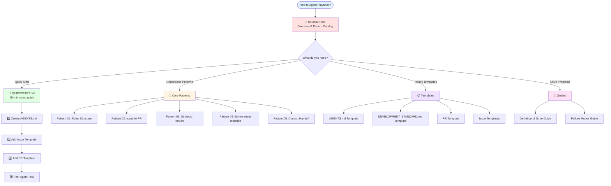
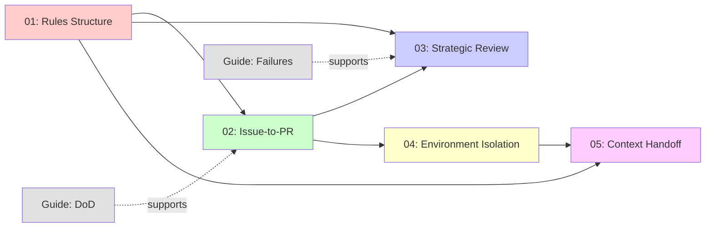

# Navigation Map

Visual guide to agent-playbook structure and recommended reading paths.

## Quick Navigation



## Reading Paths

### Path 1: "I want to start NOW" (30 minutes)

```
1. QUICKSTART.md              (5 min read)
2. templates/AGENTS.md        (create for your project)
3. templates/issue-templates/ (pick one to start)
4. Create first agent task    (try it out)
```

**Goal**: Working agent workflow in 30 minutes.

---

### Path 2: "I want to understand deeply" (2-3 hours)

```
1. README.md                           (overview)
2. patterns/01-agent-rules-structure.md
3. patterns/02-issue-to-pr-workflow.md
4. guides/definition-of-done.md
5. Pick other patterns based on needs
```

**Goal**: Deep understanding of agent development patterns.

---

### Path 3: "I'm having specific problems" (15 minutes per issue)

#### Problem: Agents go out of scope
```
→ guides/failure-modes.md (§ Context Loss)
→ patterns/02-issue-to-pr-workflow.md (Scope section)
→ templates/issue-templates/feature_request.md (Scope template)
```

#### Problem: Multiple agents conflicting
```
→ patterns/04-environment-isolation.md
→ patterns/05-context-handoff.md (coordination docs)
```

#### Problem: Inconsistent code across agents
```
→ patterns/01-agent-rules-structure.md (DEVELOPMENT_STANDARD)
→ templates/DEVELOPMENT_STANDARD.md
→ patterns/03-strategic-review.md
```

#### Problem: PRs don't meet expectations
```
→ guides/definition-of-done.md
→ templates/pr-template.md
→ guides/failure-modes.md (§ Test Theater, Incomplete Error Handling)
```

---

### Path 4: "I'm scaling to multiple agents" (1 hour)

```
1. patterns/04-environment-isolation.md  (parallel work setup)
2. patterns/05-context-handoff.md       (coordination)
3. templates/issue-templates/work_package.md (task breakdown)
4. patterns/03-strategic-review.md      (maintaining coherence)
```

**Goal**: Successfully coordinate 3+ agents working in parallel.

---

## Pattern Dependencies



**Legend**:
- Solid arrows: Foundational dependency (read first)
- Dashed arrows: Supporting relationship (helpful but optional)

## Pattern by Complexity

### Start Here (Low Complexity, High Impact)
1. **Issue-to-PR Workflow** — Simple process change
2. **Agent Rules Structure** — Just create AGENTS.md

### Next Steps (Medium Complexity, High Impact)
3. **Definition of Done** — Add to issue templates
4. **Context Handoff** — Document as you work

### Advanced (High Complexity, High Impact)
5. **Environment Isolation** — Requires infrastructure setup
6. **Strategic Review** — Requires ongoing process

### Reactive (Use When Needed)
7. **Failure Modes Guide** — Reference when problems occur

## Template Usage Map

```
Your Project
│
├── Root Files
│   ├── AGENTS.md                    ← Use template
│   ├── DEVELOPMENT_STANDARD.md      ← Use template (when needed)
│   └── [your other files]
│
├── .github/
│   ├── pull_request_template.md    ← Use pr-template.md
│   └── ISSUE_TEMPLATE/
│       ├── feature_request.md      ← Use template
│       ├── bug_report.md           ← Use template
│       └── work_package.md         ← Use template (for big tasks)
│
└── [rest of your project]
```

## Pattern by Project Stage

### Starting New Project
**Essential**:
- Pattern 01: Rules Structure → Create AGENTS.md
- Pattern 02: Issue-to-PR → Set up templates
- Guide: Definition of Done → Set expectations

**Optional**:
- Pattern 03: Strategic Review (if multi-agent)

### Growing Project (Multiple Features)
**Add**:
- Pattern 03: Strategic Review → Weekly reviews
- Pattern 05: Context Handoff → Document decisions
- Template: DEVELOPMENT_STANDARD.md → Consistent terms

### Scaling Project (Multiple Agents in Parallel)
**Add**:
- Pattern 04: Environment Isolation → Prevent conflicts
- Template: Work Package → Break down large features
- Guide: Failure Modes → Recognize issues early

### Mature Project (Many Agents, Complex System)
**All patterns** + ongoing refinement based on learnings.

## Quick Reference by Role

### For Engineering Leaders
```
1. README.md (overview)
2. Pattern 03: Strategic Review (your key role)
3. Pattern 02: Issue-to-PR (task delegation)
4. Pattern 04: Environment Isolation (if parallel work)
```

### For Solo Developers
```
1. QUICKSTART.md (get going fast)
2. Pattern 01: Rules Structure (basic docs)
3. Pattern 02: Issue-to-PR (task management)
4. Guide: Definition of Done (quality gates)
```

### For DevOps/Platform Engineers
```
1. Pattern 04: Environment Isolation (infrastructure)
2. Pattern 01: Rules Structure (agent environments)
3. Templates/AGENTS.md (document setup)
```

### For AI Researchers
```
1. README.md (full pattern catalog)
2. Guide: Failure Modes (agent behavior patterns)
3. Pattern 05: Context Handoff (knowledge transfer)
4. Pattern 03: Strategic Review (human-agent collaboration)
```

---

**Tip**: Start with QUICKSTART.md if you want results fast. Read patterns in order if you want deep understanding. Use this navigation map to find what you need when you need it.

**Last Updated**: 2026-04-30
