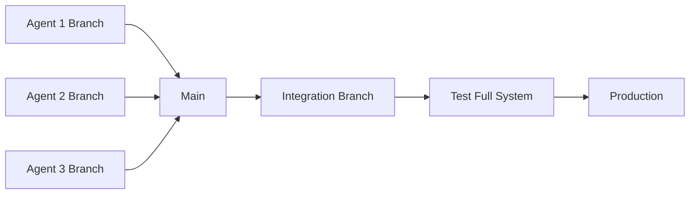

# Pattern: Environment Isolation

**Category**: Infrastructure  
**Complexity**: High  
**Impact**: High

## Context

Multiple AI agents working in parallel on the same codebase face coordination challenges:
- **Conflicting changes**: Agents modify the same files simultaneously
- **State interference**: One agent's tests affect another's environment
- **Dependency conflicts**: Different features need incompatible library versions
- **Resource contention**: Database ports, file locks, process conflicts

Traditional development handles this through:
- Communication and coordination (agents can't do this effectively)
- Careful task division (limits parallelism)
- Sequential work (defeats the purpose of having multiple agents)

## Problem

How do you enable multiple agents to work in parallel on the same project while:
1. Preventing them from interfering with each other
2. Allowing them to test their changes in isolation
3. Integrating their work safely
4. Minimizing coordination overhead

## Solution

Create **isolated, disposable environments** for each agent, aligned with your infrastructure maturity and project needs.

## Approach 1: Branch + Docker (Recommended)

### Strategy
Each agent works in:
- **Git branch**: Isolated code changes
- **Docker container**: Isolated runtime environment
- **Dedicated ports**: No resource conflicts

### Setup

**1. Docker Compose per Branch**

Create `docker-compose.yml` with environment variables:

```yaml
version: '3.8'

services:
  app:
    build: .
    ports:
      - "${APP_PORT:-3000}:3000"
    environment:
      - DATABASE_URL=postgres://user:pass@db:5432/${DB_NAME:-app}
      - REDIS_URL=redis://redis:6379/${REDIS_DB:-0}
    depends_on:
      - db
      - redis
    volumes:
      - ./src:/app/src
      - agent-data:/app/data

  db:
    image: postgres:15
    environment:
      - POSTGRES_DB=${DB_NAME:-app}
      - POSTGRES_USER=user
      - POSTGRES_PASSWORD=pass
    volumes:
      - db-data:/var/lib/postgresql/data

  redis:
    image: redis:7-alpine
    volumes:
      - redis-data:/data

volumes:
  agent-data:
  db-data:
  redis-data:
```

**2. Environment Configuration**

Create `.env.agent-1`:
```bash
APP_PORT=3001
DB_NAME=agent1_db
REDIS_DB=1
COMPOSE_PROJECT_NAME=project_agent1
```

Create `.env.agent-2`:
```bash
APP_PORT=3002
DB_NAME=agent2_db
REDIS_DB=2
COMPOSE_PROJECT_NAME=project_agent2
```

**3. Agent Workflow**

Each agent:
```bash
# Create branch
git checkout -b agent/feature-name

# Load environment
source .env.agent-N

# Start isolated environment
docker-compose up -d

# Work on feature
[make changes]

# Test in isolation
docker-compose exec app npm test

# Clean up
docker-compose down -v
```

### Benefits
✅ **Complete isolation**: Each agent has own DB, cache, services  
✅ **Parallel testing**: No test interference  
✅ **Reproducible**: Consistent environments  
✅ **Easy cleanup**: `docker-compose down -v`  

### Limitations
- Requires Docker knowledge
- Resource intensive (multiple DBs, services)
- Longer startup time

## Approach 2: Git Worktree + Process Isolation

### Strategy
Use Git worktrees for multiple working directories of the same repo, with process-level isolation.

### Setup

**1. Create Worktrees**

```bash
# Main development in main directory
cd /project

# Agent 1 gets a worktree
git worktree add ../project-agent1 agent/feature-1

# Agent 2 gets a worktree
git worktree add ../project-agent2 agent/feature-2
```

**2. Port Allocation**

Create `.env.local` in each worktree:

`/project-agent1/.env.local`:
```bash
PORT=3001
DB_PORT=5433
REDIS_PORT=6380
```

`/project-agent2/.env.local`:
```bash
PORT=3002
DB_PORT=5434
REDIS_PORT=6381
```

**3. Isolated Data Directories**

```bash
# Agent 1
export DATA_DIR=/tmp/agent1-data
export TEST_DB=agent1_test

# Agent 2
export DATA_DIR=/tmp/agent2-data
export TEST_DB=agent2_test
```

### Benefits
✅ **Lightweight**: No Docker overhead  
✅ **Fast**: Quick to set up and tear down  
✅ **Familiar**: Just git and environment variables  

### Limitations
- Shared system resources (must manage ports, files manually)
- Less isolation (same OS, shared dependencies)
- More coordination needed

## Approach 3: Hybrid (Branch + Namespaces)

### Strategy
Git branches + application-level namespacing (suitable for projects with built-in multi-tenancy or test isolation).

### Setup

**1. Branch per Agent**
```bash
git checkout -b agent/feature-name
```

**2. Test Isolation via Namespacing**

```javascript
// test-setup.js
const agentId = process.env.AGENT_ID || 'default';

beforeAll(async () => {
  // Create isolated test DB schema
  await db.createSchema(`test_${agentId}`);
  await db.useSchema(`test_${agentId}`);
});

afterAll(async () => {
  // Clean up
  await db.dropSchema(`test_${agentId}`);
});
```

**3. Feature Flags per Agent**

```javascript
const features = {
  agentId: process.env.AGENT_ID,
  enableNewFeature: process.env.AGENT_ID === 'agent-1'
};
```

### Benefits
✅ **Minimal infrastructure**: Uses existing project features  
✅ **Efficient**: Share most resources  
✅ **Simple**: Less moving parts  

### Limitations
- Requires application support for isolation
- Potential for leakage between namespaces
- Not suitable for infrastructure changes

## Integration Strategy

Once agents complete work in isolation, integrate carefully:

### 1. Progressive Integration



**Process**:
```bash
# Create integration branch
git checkout -b integration/milestone-1

# Merge agent branches one at a time
git merge agent/feature-1
# Test
git merge agent/feature-2
# Test
git merge agent/feature-3
# Full system test
```

### 2. Continuous Integration

For each agent PR:
```yaml
# .github/workflows/agent-pr.yml
name: Agent PR Check

on:
  pull_request:
    branches: [ main ]

jobs:
  isolated-test:
    runs-on: ubuntu-latest
    services:
      postgres:
        image: postgres:15
        env:
          POSTGRES_DB: test_${{ github.event.number }}
      redis:
        image: redis:7-alpine
    
    steps:
      - uses: actions/checkout@v3
      - name: Test in isolation
        run: |
          export AGENT_ID=pr-${{ github.event.number }}
          npm test
```

### 3. Environment Promotion

```
Development (isolated agents)
    ↓
Integration (combined work)
    ↓
Staging (production-like)
    ↓
Production
```

Each stage validates that combined work functions correctly.

## Implementation Guide

### Phase 1: Assess Your Project

**Questions**:
- How many agents will work in parallel? (1-2: simple, 3+: isolation critical)
- Do you have Docker expertise? (Yes: Docker approach, No: worktree approach)
- Does your app support multi-tenancy? (Yes: namespace approach feasible)
- What resources conflict? (DB, ports, files, services?)

### Phase 2: Choose Approach

| Scenario | Recommended Approach |
|----------|---------------------|
| 1-2 agents, simple app | Branch + process isolation |
| 3+ agents, complex dependencies | Docker per agent |
| Cloud-native app with multi-tenancy | Branch + namespaces |
| Microservices | Docker Compose per agent |

### Phase 3: Implement

1. **Document the setup**
   - Add to AGENTS.md
   - Provide example environment files
   - Document port allocation scheme

2. **Create automation**
   - Scripts to spin up/down agent environments
   - CI/CD integration
   - Conflict detection

3. **Test the process**
   - Verify two agents can work simultaneously
   - Confirm no interference
   - Validate cleanup works

### Phase 4: Operational Practices

1. **Environment assignment**
   ```markdown
   ## Assigned Agents
   - Agent 1: PORT=3001, DB=agent1, Branch=agent/auth
   - Agent 2: PORT=3002, DB=agent2, Branch=agent/api
   ```

2. **Cleanup policy**
   - Agents clean up after PR merge
   - Automated cleanup for abandoned branches
   - Resource monitoring

3. **Integration schedule**
   - Daily integration test of all active branches
   - Weekly full integration milestone
   - Clear ownership of integration issues

## Anti-Patterns

❌ **Shared database without isolation**
- Tests interfere with each other
- Race conditions in parallel test runs
- ✅ Fix: Separate DB per agent or schemas

❌ **Hard-coded ports**
- Port conflicts prevent parallel work
- ✅ Fix: Environment variables for all ports

❌ **Stateful tests without cleanup**
- Previous test runs affect current runs
- ✅ Fix: Clean slate for each test run

❌ **No integration testing**
- Branches work alone but break when combined
- ✅ Fix: Regular integration testing

❌ **Ignoring resource limits**
- Running 10 Docker environments on 8GB RAM
- ✅ Fix: Monitor resources, limit concurrent agents

## Benefits

✅ **True parallelism**: Multiple agents work simultaneously  
✅ **No coordination**: Agents don't need to know about each other  
✅ **Safe experimentation**: Failures don't affect others  
✅ **Faster development**: No waiting for shared resources  
✅ **Better testing**: Each agent tests in clean environment  

## Real-World Example

**Project**: 9 work packages, each assigned to an agent

**Setup**:
- Docker Compose with environment variables
- Each agent gets: PORT + DB_NAME + REDIS_DB + branch
- Centralized tracking document:
  ```
  Agent   Branch                  Port    DB        Status
  ------  ----------------------  ------  --------  --------
  A1      agent/memory-adapter    3001    agent1    Active
  A2      agent/experience-store  3002    agent2    Active
  A3      agent/identity          3003    agent3    Testing
  ```

**Results**:
- 3 agents worked simultaneously on different components
- Zero conflicts or interference
- Each agent tested in isolation
- Integration happened in dedicated integration branch
- 50% reduction in total development time vs sequential

## Variations

### Minimal (1-2 Agents)
- Just branches + different ports
- Shared dependencies
- Manual coordination

### Standard (3-5 Agents)
- Docker Compose per agent
- Automated environment setup
- Regular integration testing

### Advanced (5+ Agents)
- Kubernetes namespaces per agent
- Automated environment provisioning
- Continuous integration/deployment
- Resource quotas and monitoring

## Related Patterns

- [Issue-to-PR Workflow](02-issue-to-pr-workflow.md) — Agent gets isolated environment for PR work
- [Context Handoff](05-context-handoff.md) — Share environment setup in handoff docs
- [Work Package Template](../templates/issue-templates/work_package.md) — Structure work for parallel execution

## Tools

- **Docker / Docker Compose**: Container isolation
- **Git Worktree**: Multiple working directories
- **Kubernetes**: Advanced orchestration
- **Terraform / Pulumi**: Infrastructure as code
- **GitHub Actions / GitLab CI**: Automated testing in isolated environments

---

**Status**: Stable  
**Last Updated**: 2026-04-30
